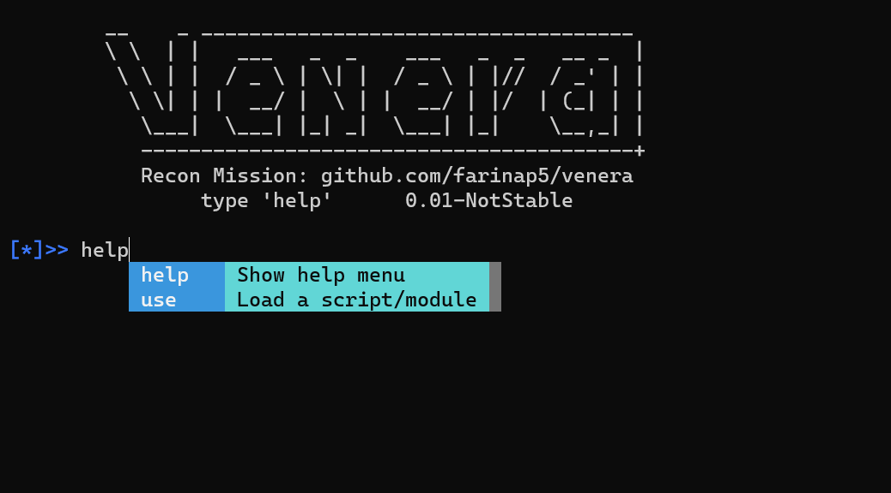

<h1 align="center">Venera Framework</h1>

Venera is a tool for automating customized tests and attacks agaist many kinds of protocol. It relies on a scripting engine based on the Lua scripting language that makes it possible to create modules for all types of checks and exploits. The framework is a manager and interpreter of lua scripts that provides functions and libraries for the creation of powerful tools used during unitary tests, vulnerability scanning and exploitation fase. The user can create its own modules or use community made scripts, tool is switchable for all kinds of need situation.


---

### Help Menu
```
COMMAND DESCRIPTION
------- -----------
help     Show help menu
bash     Spawn shell           
use      Load a script/module
back     Exit module/script
options  Show variables of script/module
info     Info/metadata about script/module
globals  Show global variables
run      Run a script/module
set      Set value for a ver
lua      Run Lua code in running mod
import   Import a (to edited) script
export   Export a script (to edit)

BASIC NAVEGATION:
    Press `TAB` to rotate suggestions.
    Press `arrow key` to pass suggentions or history.
    Press `CTRL-d` to exit.
    Press `CTRL-l` to clear promp.

SEARCHING:
    `search` list scripts/modules.
    `search match <key>` list witch maches patter.
    `search match:path <key>` list path matching.
    `search match:description <key>` list description matching.
    `search tag <tag1 tag2...>` list tags matching.
    `s m <key>` filter in collapsed format.
        `s m:p <key>` filter by path.
        `s m:d <key>` filter by description.
        `s t <tag1 tag2...>` filter by tags.

USE SCRIPT/MODULE:
    `use path/to/script.lua` Configure a script.
    `use tags http sql` Set scripts matching with tags.

SET VARIABLE:
    `set RHOST <value>` Configure var for an in use test.
    `set global RHOST <value>` Configure var to a chain of tests.
```
---

## How does a module work? 

The module has some essential tables as `METADATA` and `VARS` being loaded from `Init()` and then the `Main()` function with the entrypoint of custom functions execution.

### Table `METADATA`

`METADATA` carries information reguarding the script so Venera can identify this module in its script base, all fields need to be configured.
- `AUTHOR` is a list of strings, others who created the script or have participated in research for that flaw it abuses as example.
- `VERSION` module/script version.
- `TAGS` Some tags that define the script and its purpose. Scripts can be searched and executed based on their tags.
- `INFO`The description of the script can, fault that abuses, type of test, proposed mitigations, it's up to the creator.

```
METADATA = {
    AUTHOR = {"Author1 <author1@mail.com>"},
    VERSION = "0.1",
    TAGS = {"example","http"},
    INFO = [[HTTP requests with lua-go]]
}
```
### Table `VARS`

`VARS` table loads the script's variables, which it uses as parameters for its actions.

```
VARS = {
    URL = {VALUE="http://example.com", NEEDED="yes", DESCRIPT="URL"},
    METHOD = {VALUE="GET", NEEDED="yes", DESCRIPT="METHOD"}
}
```

the user can see these variables with the `options` command:

```
(scripts/test/http.lua)>> options

VARIABLE  DEFAULT             NEEDED  DESCRIPTION
--------  -------             ------  -----------
URL       http://example.com  yes     URL
METHOD    GET                 yes     METHOD
```

User also can edit those variables with the `set` command:

```
(scripts/test/http.lua)>> set URL http://google.com
[OK] URL <- http://google.com
```

### Function `Init()`

When you run `use <script.lua>` the `Init()` function is automatically executed, so the metadata and variables are loaded. You can put other things in the function to load on the first iteration.

```
function Init()
    Meta(METADATA) -- Load metadata 
    LoadVars(VARS) -- Load variables
end
```

### Function `Main()`
The function `Main()` is the entrypoint of your custom tests. It is called when user types `run`.
```
function Main()
    local request = http.request(VARS.METHOD.VALUE, VARS.URL.VALUE)
    local result, err = client:do_request(request)
    PrintSuccsln(result.code)
    PrintSuccsln(result.body)
end
```

## Built-in Functions

You can call those function within the script without requirements.

`PrintSuccs( str )` Print success message.

`PrintErr( str )` Print error message.

`PrintInfo( str )` Print info message.

`PrintSuccsln( str )`  Print success message with line ending.

`PrintErrln( str )` Print error message with line ending.

`PrintInfoln( str )` Print info message with line ending.

`Print( str )` Print string.

`Println( str )` Print string with line ending.

`RandomString( length=int , "a-zA-Z0-9" ) -> str` Generates random string.

`Input( str ) ->  str` Prompt for an user input.

`Open( str ) -> str` Read a local file.

`Call( path=str )` Call another script/module. The `ARGS` from caller scripts are inherited by scripts being called. 